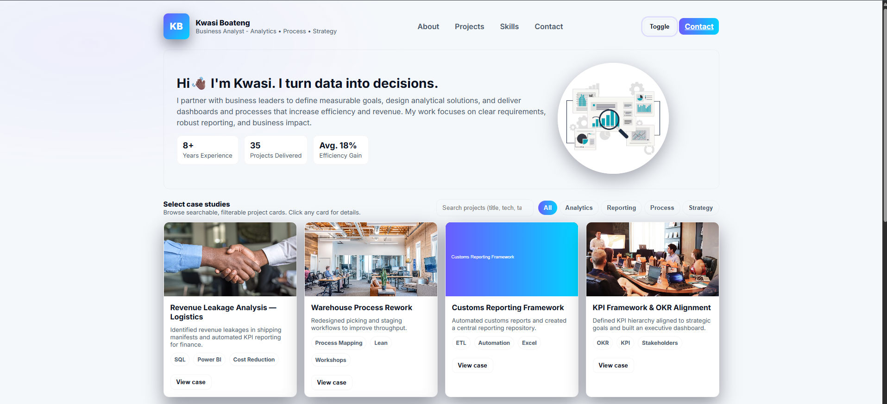

# Business Analyst Portfolio Website

A modern, responsive, and professional portfolio website designed for a Business Analyst.  
The site highlights skills, showcases projects through case studies, and provides a simple way for recruiters, employers, or clients to connect.  
It features a clean design, smooth animations, and a dark/light mode toggle for a contemporary feel.

---




## Features

- **Hero Section**: Professional introduction with a tagline and call-to-action.
- **Skills Overview**: A quick snapshot of key business analysis and technical skills.
- **Projects / Case Studies Section**: Modern card-style layout to showcase work, dashboards, process improvements, and case studies.
- **Contact Section**: Easy-to-access contact details for networking and opportunities.
- **Dark/Light Mode**: Toggle between themes, with user preference saved in local storage.
- **Responsive Design**: Optimized for desktop, tablet, and mobile devices.

---

## Tech Stack

- **HTML5** – Semantic and accessible structure
- **CSS3** – Custom styling with modern layouts and transitions
- **JavaScript (Vanilla)** – For interactivity, theme toggle, and project rendering
- **Google Fonts (Lexend / Inter)** – Clean and professional typography
- **Responsive Grid & Flexbox** – For adaptive layouts

---

## Getting Started

Follow these steps to run the project locally:

### 1. Clone the Repository
```bash
git clone https://github.com/your-username/business-analyst-portfolio.git
```

### 2. Navigate into the Project
```bash
cd business-analyst-portfolio
```

### 3. Open in Browser
Simply open the `index.html` file in your browser:
```bash
open index.html
```
or  
```bash
start index.html
```

---

## Project Structure

```bash
business-analyst-portfolio/
│
├── index.html        # Main entry point
├── /imgs             # Images and profile picture
├── /css              # Optional folder if you separate CSS
├── /js               # Optional folder if you separate JS
└── README.md         # Documentation
```

---

## Customization

1. **Profile Info**  
   - Update your name, tagline, and bio in the **hero section** of `index.html`.

2. **Projects**  
   - Modify the `projects` array in the JavaScript code to add your own:
     - `title`: Project or case study name  
     - `desc`: Short description  
     - `img`: Image or dashboard screenshot  
     - `tech`: Tools or techniques used  
     - `tags`: Project type (e.g., Reporting, Analytics, Process Improvement)  
     - `demo`: Link to project details or presentation  

3. **Branding**  
   - Replace the `logo` initials (currently "KB") with your own.
   - Update the color palette in the `:root` CSS variables for your brand identity.

4. **Contact Info**  
   - Update the email link and footer details in `index.html`.

---

## Responsiveness

- The site is mobile-first and fully responsive.  
- Projects display in a single-column layout on smaller devices and in a grid layout on larger screens.  
- Buttons and navigation are touch-friendly for mobile users.

---

## Future Enhancements

- Add a **blog section** to share insights on business analysis, data, and case studies.
- Integrate **Google Analytics** to track portfolio visits.
- Deploy via **GitHub Pages**, **Netlify**, or **Vercel** for free hosting.
- Include **downloadable resume (PDF)** directly in the hero section.

---

## Author

**Kwasi Boateng**  
Business Analyst • Data-Driven Strategist   
[LinkedIn Profile](https://linkedin.com/)  

---

## License

This project is open-source and available under the [MIT License](LICENSE).
